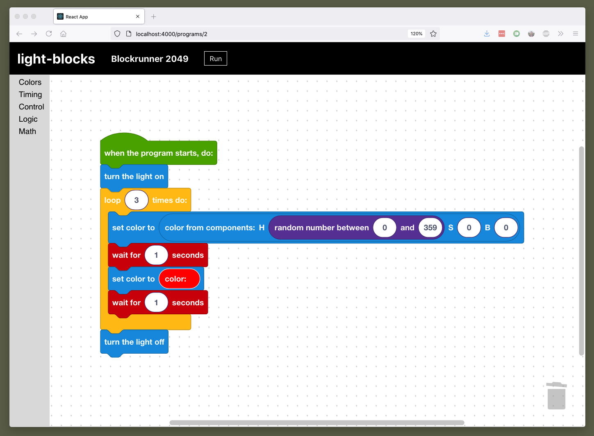

# Light Blocks

Control Philips Hue lights with Blocks!



## About the project

Colorful ambient light is cool, and programming is cool! Philips Hue lights have an API for developers to create cool apps and experiences. But not everyone knows how to code with traditional text-based programming. Light Blocks lets you program and create dynamic, evolving light shows, without needing to know how to code. It's a great way to learn about logic and programming, and once again...colorful ambient light is cool!

Light Blocks is a [visual programming language](https://en.wikipedia.org/wiki/Visual_programming_language) built on top of [Blockly](https://developers.google.com/blockly), a project by Google and MIT that also powers [Scratch](https://scratch.mit.edu/). The environment provides special blocks for setting colors of lights, but also includes a whole "language" of blocks that are executed, to make powerful programs. Blocks include "if/else", "loop", "pick a random number", and more. There are also more powerful blocks that can run logic on multiple lights at the same time.

## Installation

### Step 1: Get credentials to your Philips Hue bridge

Follow the official [getting started guide](https://developers.meethue.com/develop/hue-api-v2/getting-started/) to create a username (also called "appkey") and client key.

Then set environment variables from the values in the script output:

```bash
export HUE_BRIDGE_IP_ADDRESS=x.x.x.x
export HUE_BRIDGE_CLIENT_KEY=xxxxxxxxxxx
export HUE_BRIDGE_USER=xxxxxxxxxxx
```

### Step 2: Configure and run Light Blocks with the credentials

#### Option 1: Docker

You can find the [adj90/light-blocks](https://hub.docker.com/r/adj90/light-blocks) image on Docker Hub. The image is built for multiple processor architectures, including Raspberry Pi!

Run this command:

```bash
docker run \
  -it \
  --rm \
  -p 4000:4000 \
  --env HUE_BRIDGE_IP_ADDRESS \
  --env HUE_BRIDGE_CLIENT_KEY \
  --env HUE_BRIDGE_USER \
  --env NODE_ENV=production \
  --volume=/path/to/your/db-directory/:/db/ \
  adj90/light-blocks
```

Then the server should be available at http://localhost:4000.

#### Option 2: Compiling locally

Light Blocks is written in NodeJS. You'll need version 12.x or above.

```bash
# Install dependencies and build everything:
bin/build.sh

# Then run the server:
bin/run.sh
```

After building and running, the server should be available at http://localhost:4000.
